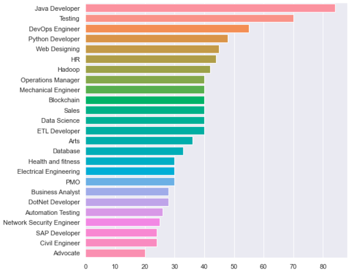
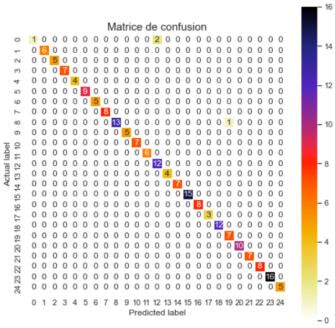

# Classification de CV avec la NLP

## Objectif du projet

L'objectif de ce projet est de classer des CV en anglais dans 25 classes différentes à l'aide du ***Natural Language Processing***

Les classes sont distribué comme ceci:



## Création du modèle

Afin de créer un modèle performant pour ce sujet de classification nous avons utilisé plusieurs fonctions du module Sklearn en Python.
- Count Vectorizer
- Logistical Regression

### Count Vectorizer

Nous avons utilisé le Count Vectorizer avec ```stop_words='english'``` et ```min_df=10``` en paramètres afin de supprimer tous les mots non intéressant des CV et ne pas garder les mots qui apparaissent moins de 10 fois dans le dataset.

### Logistical Regression

Une fois nos CV vectorisés et nos classes encodé, nous pouvons passer nos données dans un modèle de Logistical Regression qui va s'occuper de la classification.
Une fois l'entrainement terminé nous pouvons donc appliquer le modèle sur notre base de test afin d'en vérifier l'efficacité.

## Résultats

Le modèle nous donne une accuracy de 98.44% sur les 20% de test du dataset. Nous pouvons donc observer cette matrice de confusion.

